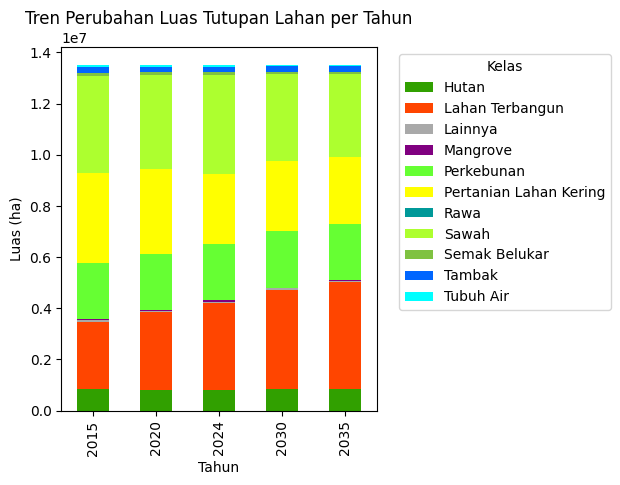
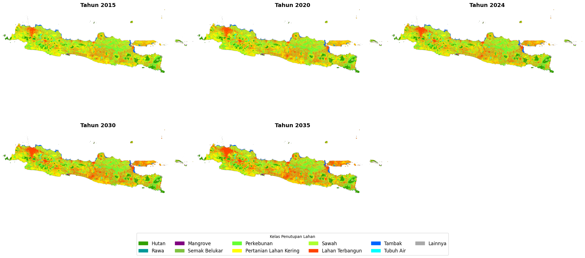

[](https://colab.research.google.com/drive/XXXXXXXXXXXXXXXXX#offline=true&sandboxMode=true)
# 🐦🗺️ CAMAR Project 
**Proyek Penelitian S3 PSL-IPB**: Model Simulasi Prediksi Perubahan LULC (Land Use/Land Cover)

**Peneliti**: Seniarwan<sup>1</sup>, dibawah bimbingan [Prof. Baba Barus](https://scholar.google.co.id/citations?hl=id&user=zOtjie8AAAAJ)<sup>2</sup>, [Prof. Suria D. Tarigan](https://scholar.google.com/citations?user=ukdzSPsAAAAJ&hl=id&oi=ao)<sup>2</sup>, dan [Prof. Agus Buono](https://scholar.google.com/citations?user=CDIv9k0AAAAJ&hl=en)<sup>3</sup>

   <sup>1</sup> *Mahasiswa S3, Sekolah Pascasarjana, Program Studi Ilmu Pengelolaan Sumberdaya ALam dan Lingkungan, IPB University (psl24seniarwan@apps.ipb.ac.id).*
   
   <sup>2</sup> *Departemen Ilmu Tanah dan Sumberdaya Lahan, Fakultas Pertanian, IPB University, Indonesia*
   
   <sup>3</sup> *Departemen Ilmu Komputer, Sekolah Sains Data, Matematika, dan Informatika (SSMI), IPB University, Indonesia*

**CAMAR** adalah sebuah kerangka kerja pemodelan spasial yang dikembangkan dengan Python untuk simulasi dan prediksi perubahan LULC di masa depan. Nama model ini dipilih sebagai akronim dari `Cellular Automata-Markov for Land Change Simulator`, sekaligus sebagai metafora atas kemampuan burung Camar dalam membaca perubahan lingkungan dan beradaptasi secara spasial.

Proyek ini dirancang untuk menjadi model fleksibel, tangguh, dan mudah diadaptasi untuk berbagai skenario penelitian, terutama dalam konteks perencanaan tata ruang, analisis dampak bencana/lingkungan, dan studi urbanisasi. Pada notebook telah tersedia data sampel yang diakses langsung melalui gdrive dan model yang dapat langsung dijalankan.

## 🚀 Fitur Utama
Model CAMAR dilengkapi dengan serangkaian fitur yang menjadikannya alat yang canggih dan adaptif untuk penelitian:

🔹 **Simulasi Dua Mode**:

   - **Mode Berbasis Tren (Evolusioner)**: Mensimulasikan perubahan lahan berdasarkan tren historis, cocok untuk skenario *business-as-usual* (tanpa intervensi).
   
   - **Mode Alokasi Berbasis Permintaan (Demand-Driven)**: Mensimulasikan perubahan dengan mematuhi batasan spasial (misalnya, kawasan lindung, LP2B, rencana tata ruang), ideal untuk analisis kebijakan.

🔹 **Dukungan Multi-Metode Proyeksi Matriks Transisi**:

   - `Linear`: Proyeksi standar berbasis dua peta historis.

   - `Logarithmic`: Proyeksi tren dengan faktor logaritmik, cocok untuk meminimalkan bias trend ekstrim di masa depan.

   - `Quadratic Regression`: Proyeksi berbasis regresi kuadratik jika tersedia tiga atau lebih peta historis, untuk menangkap pola perubahan yang tidak linier.

   - `Auto-Switch`: Pipeline dapat memilih metode otomatis sesuai jumlah data historis atau pengaturan `TREND_METHOD`.

🔹 **Validasi Otomatis**

Otomatis melakukan validasi model untuk tahun-tahun historis tertentu, lengkap dengan metrik akurasi spasial (`Kappa`, `Jaccard`, `Precision/Recall/F1` per kelas, dsb).

🔹 **Otomatisasi Tahun Target**:

   - Tahun target prediksi dihasilkan otomatis berdasarkan pola interval data historis.
   - Pipeline akan menghitung interval rata-rata antar data historis dan secara otomatis menghasilkan daftar tahun prediksi ke depan, misal `[2030, 2035, 2040]`, dst, tanpa perlu diisi manual.

🔹 **Konfigurasi Fleksibel dan Adaptif**

   - Konfigurasi pipeline mudah disesuaikan lewat parameter di notebook/script.
   - Semua hasil simulasi, log, dan matriks transisi disimpan otomatis.

🔹 **Komputasi Paralel Otomatis (Multiprocessing)**

   - Implementasi fungsi kritis dengan `Cython` untuk komputasi sangat cepat di Linux/Colab, otomatis fallback ke `Numba` jika Cython tidak tersedia.
   - Dukungan paralelisasi tile/grid berbasis multiprocessing.

🔹 **Integrasi Machine Learning**:

Pipeline dapat dikombinasikan dengan model Machine Learning seperti `Random Forest, Logistic Regression, SVM, dll` untuk membangkitkan `suitability map` secara otomatis. [in progress]

## 🧠 Metodologi

1. **Penyusunan Data Historis**  
   - Kumpulkan peta LULC multi-temporal (misal: tahun `t0, t1, t2`) dalam bentuk raster/grid.  
   - Siapkan data prediktor spasial (variabel geobiofisik-lingkungan, sosial ekonomi, dll) untuk *suitability map*.
   
2. **Penyusunan Suitability/Probability Map**  
   Suitability/probability map adalah raster yang menunjukkan kecocokan setiap piksel untuk tiap kelas.  
   Model Machine Learning (ML; seperti Random Forest, Logistic Regression, SVM, dll) digunakan untuk memetakan hubungan antara piksel (dengan variabel prediktor $X$) dan kelas lahan target:

   $S_{i, c} = ML_c(X_i)$

   dimana:
   - $S_{i, c}$ = Skor suitability piksel $i$ untuk kelas $c$  
   - $ML_c$ = Model ML kelas $c$  
   - $X_i$ = Vektor fitur/prediktor di piksel $i$
   
   Hasil prediksi $S$ ditunjukkan dengan nilai probabilitas [0, 1] per kelas LULC.   

3. **Perhitungan Matriks Transisi Markov**  
   Hitung matriks transisi probabilitas antar kelas lahan berdasarkan dua waktu historis.  
      
   $$P_{i,j} = \frac{N_{i \rightarrow j}}{\sum_{k} N_{i \rightarrow k}}$$

   dimana:
   - $P_{i,j}$ = Probabilitas perubahan dari kelas $i$ ke kelas $j$  
   - $N_{i \rightarrow j}$ = Jumlah piksel berpindah dari $i$ ke $j$

4. **Interpolasi Matriks Transisi**  
   Untuk prediksi masa depan, matriks transisi diinterpolasi linier berdasarkan dua periode historis.
     
   $$\mathbf{P}_{\mathrm{proj}} = \mathbf{P}_B + \frac{(\mathbf{P}_B - \mathbf{P}_A)}{\Delta t{A \rightarrow B}} \cdot (t{\mathrm{target}} - t_B)$$

   dimana:
   - $\mathbf{P}_A$, $\mathbf{P}_B$ = Matriks transisi dari dua periode historis  
   - $t_{target}$ = Tahun prediksi  
   - $t_B$ = Tahun akhir data historis

5. **Perhitungan Efek Spasial (Neighborhood/Contiguity)**  
   Menggunakan kernel Moore 5x5:

   ```
   0  0  1  0  0 
   0  1  1  1  0
   1  1  1  1  1
   0  1  1  1  0
   0  0  1  0  0
   ```


   Efek kontiguitas dihitung melalui konvolusi:
   
   $C_{i,c} = \text{Convolve2D}(\mathbb{I}(y = c), K_{5 \times 5}) + \delta$
   
   dimana $\delta$ adalah offset kecil untuk menghindari nol.

6. **Simulasi Cellular Automata (CA)**  
   Untuk setiap piksel, peluang transisi kelas dihitung berdasarkan:
   
   $P'{i,j} = P{i,j} \cdot S_{i,j} \cdot C_{i,j}$

   Probabilitas dinormalisasi dan proses update dilakukan untuk setiap waktu prediksi.

7. **Validasi dan Visualisasi**  
   Hasil prediksi diverifikasi menggunakan metrik spasial: Cohen’s Kappa, Jaccard, F1-Score, dan analisis perubahan spasial.

## 🗺️ Contoh Hasil

**Log Simulasi**

```
Logging diaktifkan ke file output_data/simulation.log
Memuat data historis...
Jumlah kelas terdeteksi: 11
Tahun target yang diperbolehkan: [2030, 2035]

==================================================
TAHAP 1: VALIDASI MODEL
==================================================

--- Memvalidasi prediksi untuk 2024 dari 2020 ---
Menggunakan tren dari periode 2015-2020

--- Menjalankan Simulasi untuk Target: 2024 ---
Processing Tiles for 2024: 100%|██████████| 3234/3234 [03:20<00:00, 16.12it/s]
Merging Tiles for 2024: 100%|██████████| 3234/3234 [00:11<00:00, 284.41it/s]
Simulasi mode evolusi selesai. Hasil disimpan di: output_data/predicted_map_evolutionary_2024.tif

--- Menghitung Akurasi Model ---
Cohen's Kappa: 0.7922
Overall Jaccard Score: 0.7241
Overall Precision: 0.8436
Overall Recall: 0.8363
Overall F1-Score: 0.8362

Metrik per Kelas:
╒════════════════════════╤═════════════╤══════════╤════════════╤═══════════╕
│ Kelas                  │   Precision │   Recall │   F1-Score │   Support │
╞════════════════════════╪═════════════╪══════════╪════════════╪═══════════╡
│ Hutan                  │    0.958655 │ 0.975901 │   0.967201 │    814607 │
├────────────────────────┼─────────────┼──────────┼────────────┼───────────┤
│ Rawa                   │    0.623131 │ 0.838926 │   0.715103 │       745 │
├────────────────────────┼─────────────┼──────────┼────────────┼───────────┤
│ Mangrove               │    0.871737 │ 0.68138  │   0.764893 │     46761 │
├────────────────────────┼─────────────┼──────────┼────────────┼───────────┤
│ Semak Belukar          │    0.749866 │ 0.756829 │   0.753331 │    110922 │
├────────────────────────┼─────────────┼──────────┼────────────┼───────────┤
│ Perkebunan             │    0.899147 │ 0.926685 │   0.912709 │   2201983 │
├────────────────────────┼─────────────┼──────────┼────────────┼───────────┤
│ Pertanian Lahan Kering │    0.707016 │ 0.885589 │   0.786291 │   2734121 │
├────────────────────────┼─────────────┼──────────┼────────────┼───────────┤
│ Sawah                  │    0.900291 │ 0.834941 │   0.866385 │   3869760 │
├────────────────────────┼─────────────┼──────────┼────────────┼───────────┤
│ Lahan Terbangun        │    0.826431 │ 0.713616 │   0.765892 │   3376364 │
├────────────────────────┼─────────────┼──────────┼────────────┼───────────┤
│ Tambak                 │    0.854491 │ 0.942652 │   0.896409 │    199170 │
├────────────────────────┼─────────────┼──────────┼────────────┼───────────┤
│ Tubuh Air              │    0.924518 │ 0.677699 │   0.782098 │     93872 │
├────────────────────────┼─────────────┼──────────┼────────────┼───────────┤
│ Lainnya                │    0.774553 │ 0.581306 │   0.664158 │     69829 │
╘════════════════════════╧═════════════╧══════════╧════════════╧═══════════╛

==================================================
TAHAP 2: PREDIKSI LULC MASA DEPAN
==================================================

--- Memulai prediksi untuk tahun 2030 dari 2024 ---
Matriks Transisi Proyeksi untuk 2030 disimpan di output_data/projected_matrix_2030.csv

--- Menjalankan Simulasi untuk Target: 2030 ---
Processing Tiles for 2030: 100%|██████████| 3234/3234 [03:20<00:00, 16.11it/s]
Merging Tiles for 2030: 100%|██████████| 3234/3234 [00:11<00:00, 291.08it/s]Simulasi mode evolusi selesai. Hasil disimpan di: output_data/predicted_map_evolutionary_2030.tif

--- Memulai prediksi untuk tahun 2035 dari 2030 ---
Matriks Transisi Proyeksi untuk 2035 disimpan di output_data/projected_matrix_2035.csv

--- Menjalankan Simulasi untuk Target: 2035 ---

Processing Tiles for 2035: 100%|██████████| 3234/3234 [02:56<00:00, 18.29it/s]
Merging Tiles for 2035: 100%|██████████| 3234/3234 [00:11<00:00, 285.33it/s]
Simulasi mode evolusi selesai. Hasil disimpan di: output_data/predicted_map_evolutionary_2035.tif

Proses Selesai.
```
**Grafik Perubahan Luas**



**Peta Hasil Prediksi**  




**WORK IN PROGRESS**
